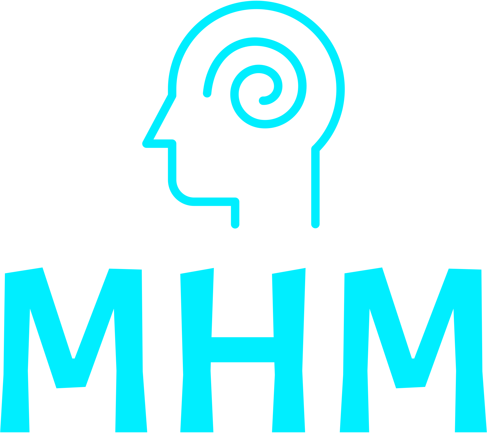
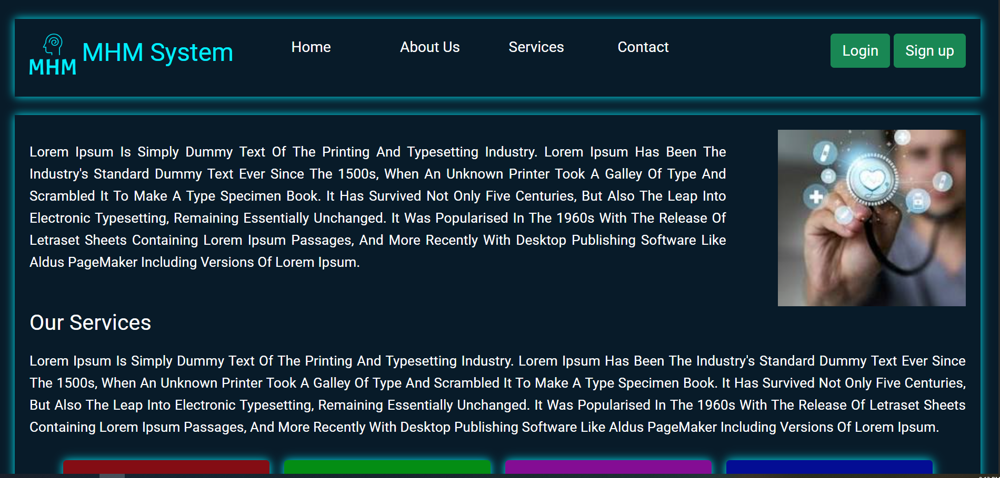
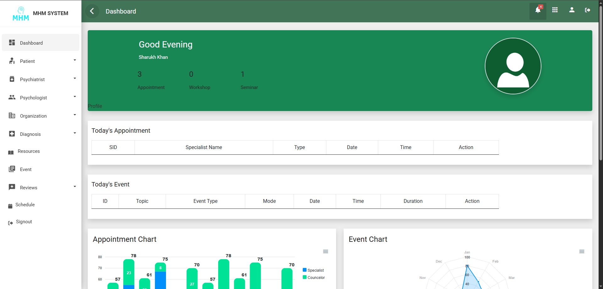
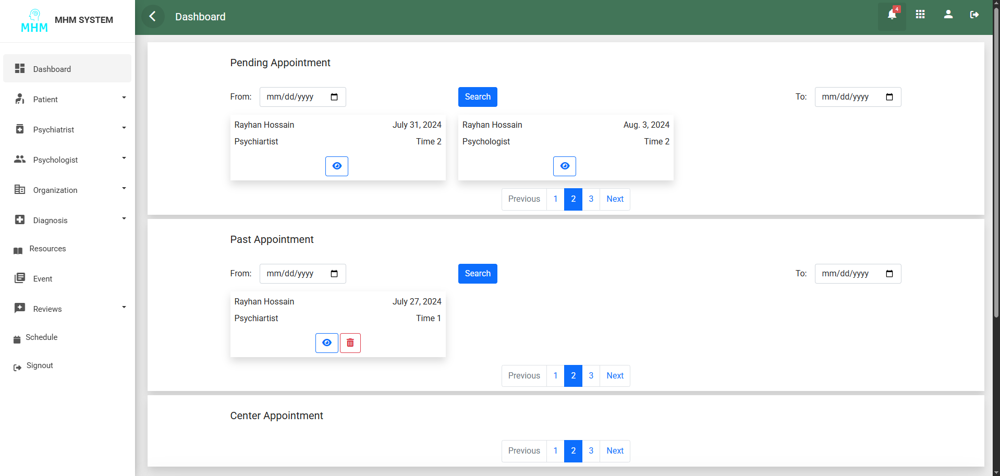
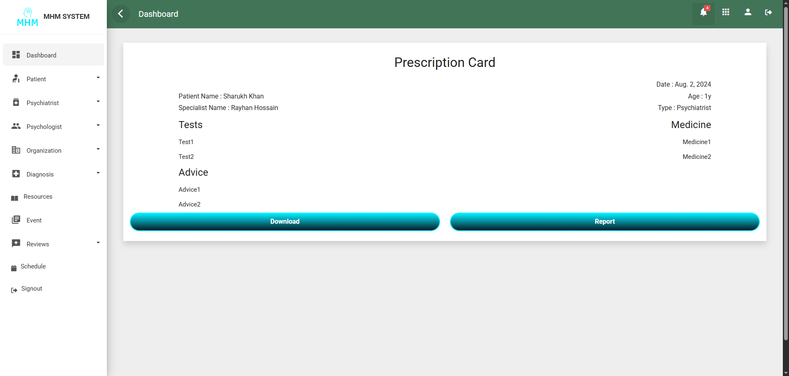

# 🧠 MindEase — Mental Health Support System

**MindEase** is a web-based platform designed to make mental health care more accessible and organized.  
Users can easily **book doctor appointments**, **receive online prescriptions**, and **manage test reports** — no need to carry physical documents anymore.

---

## 🌟 Features

- 🩺 **Doctor Appointment System** – Find and book doctors across the country based on location and specialization.  
- 💊 **Online Prescription** – Get digital prescriptions directly from doctors.  
- 📄 **Report Management** – Upload, view, and download test reports anytime.  
- 🌍 **Location-Based Search** – Quickly find nearby doctors and clinics.  
- 🔒 **Secure Accounts** – Separate login for patients and doctors.  
- 💬 **Responsive Design** – Built with Bootstrap for a clean and mobile-friendly interface.

---

## 🖥️ Tech Stack

- **Frontend:** HTML, CSS, JS, Bootstrap  
- **Backend:** Django (Python)  
- **Database:** MySQL  
- **Server:** Localhost

---

---

## 🖼️ Demo

  
  
  
  
  

